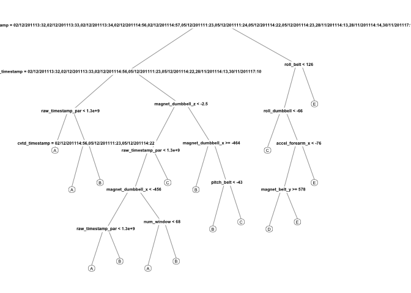

# Final Project Report - Practical Machine Learning Course
Ruben Maso  
24 de diciembre de 2015  

# Background Introduction
These are the files produced during a homework assignment of Coursera's MOOC Practical Machine Learning from Johns Hopkins University. Here is the introduction of the exercise:

"Using devices such as Jawbone Up, Nike FuelBand, and Fitbit it is now possible to collect a large amount of data about personal activity relatively inexpensively. These type of devices are part of the quantified self movement ??? a group of enthusiasts who take measurements about themselves regularly to improve their health, to find patterns in their behavior, or because they are tech geeks. One thing that people regularly do is quantify how much of a particular activity they do, but they rarely quantify how well they do it. In this project, your goal will be to use data from accelerometers on the belt, forearm, arm, and dumbell of 6 participants. They were asked to perform barbell lifts correctly and incorrectly in 5 different ways. More information is available from the website here: [http://groupware.les.inf.puc-rio.br/har](see the section on the Weight Lifting Exercise Dataset)."


Data Sources
The training data for this project are available here:

[https://d396qusza40orc.cloudfront.net/predmachlearn/pml-training.csv]

The test data are available here:

[https://d396qusza40orc.cloudfront.net/predmachlearn/pml-testing.csv]

The data for this project comes from this original source: [http://groupware.les.inf.puc-rio.br/har]. If you use the document you create for this class for any purpose please cite them as they have been very generous in allowing their data to be used for this kind of assignment.

Please Note that I the code I use loads the data from the file system, so that you are must download the files to your environment. Please customize the code to your specific needs.

# Project Intended Results
The goal of your project is to predict the manner in which they did the exercise. This is the "classe" variable in the training set. You may use any of the other variables to predict with. You should create a report describing how you built your model, how you used cross validation, what you think the expected out of sample error is, and why you made the choices you did. You will also use your prediction model to predict 20 different test cases.

1. Your submission should consist of a link to a Github repo with your R markdown and compiled HTML file describing your analysis. Please constrain the text of the writeup to < 2000 words and the number of figures to be less than 5. It will make it easier for the graders if you submit a repo with a gh-pages branch so the HTML page can be viewed online (and you always want to make it easy on graders :-).

2. You should also apply your machine learning algorithm to the 20 test cases available in the test data above. Please submit your predictions in appropriate format to the programming assignment for automated grading. See the programming assignment for additional details.


```r
library(caret)
```

```
## Loading required package: lattice
## Loading required package: ggplot2
```

```r
library(rpart)
library(rpart.plot)
library(RColorBrewer)
library(rpart.plot)
library(randomForest)
```

```
## randomForest 4.6-12
## Type rfNews() to see new features/changes/bug fixes.
```


Finally, load the same seed with the following line of code:

```r
set.seed(666)
```

# Getting the data
The training and testing data files:


```r
trainUrl <- "pml-training.csv"
testUrl <- "pml-testing.csv"
```

Load data 

```r
training <- read.csv(trainUrl, na.strings=c("NA","#DIV/0!",""))
testing <- read.csv(testUrl, na.strings=c("NA","#DIV/0!",""))
```

# Partioning data
Partioning Training data set into two data sets, 60% for myTraining, 40% for myTesting:


```r
inTrain <- createDataPartition(y=training$classe, p=0.6, list=FALSE)
myTraining <- training[inTrain, ]; myTesting <- training[-inTrain, ]
dim(myTraining); dim(myTesting)
```

```
## [1] 11776   160
```

```
## [1] 7846  160
```

# Cleaning the data
The following transformations were used to clean the data:

### Transformation 1: Cleaning NearZeroVariance Variables 
Run this code to view possible NZV Variables:


```r
myDataNZV <- nearZeroVar(myTraining, saveMetrics=TRUE)
```

Run this code to create another subset without NZV variables:


```r
myNZVvars <- names(myTraining)[!myDataNZV$nzv]
myTraining <- myTraining[myNZVvars]
dim(myTraining)
```

```
## [1] 11776   131
```

Transformation 2: Killing first column of Dataset - ID Removing first ID variable so that it does not interfer with ML Algorithms:


```r
myTraining <- myTraining[c(-1)]
```

Transformation 3: Cleaning Variables with too many NAs. For Variables that have more than a 60% threshold of NA's I'm going to leave them out:


```r
trainingV3 <- myTraining #creating another subset to iterate in loop
for(i in 1:length(myTraining)) { #for every column in the training dataset
        if( sum( is.na( myTraining[, i] ) ) /nrow(myTraining) >= .6 ) { #if n?? NAs > 60% of total observations
        for(j in 1:length(trainingV3)) {
            if( length( grep(names(myTraining[i]), names(trainingV3)[j]) ) ==1)  { #if the columns are the same:
                trainingV3 <- trainingV3[ , -j] #Remove that column
            }   
        } 
    }
}
#To check the new N?? of observations
dim(trainingV3)
```

```
## [1] 11776    58
```

```r
#Seting back to our set:
myTraining <- trainingV3
rm(trainingV3)
```


Now let us do the exact same 3 transformations but for our myTesting and testing data sets.

```r
clean1 <- colnames(myTraining)
clean2 <- colnames(myTraining[, -length(myTraining)]) #already with classe column removed
myTesting <- myTesting[clean1]
testing <- testing[clean2]

#To check the new N?? of observations
dim(myTesting)
```

```
## [1] 7846   58
```

```r
#To check the new N?? of observations
dim(testing)
```

```
## [1] 20 57
```

```r
#Note: The last column - problem_id - which is not equal to training sets, was also "automagically" removed
#No need for this code:
#testing <- testing[-length(testing)]
```

# Using ML algorithms for prediction: Decision Tree

```r
modFitA1 <- rpart(classe ~ ., data=myTraining, method="class")
```

To view the decision tree with fancy run this command:

```r
rpart.plot(modFitA1)
```

 

```r
# fancyRpartPlot(modFitA1)
```

Predicting:


```r
predictionsA1 <- predict(modFitA1, myTesting, type = "class")
```

Using confusion Matrix to test results:

```r
confusionMatrix(predictionsA1, myTesting$classe)
```

```
## Confusion Matrix and Statistics
## 
##           Reference
## Prediction    A    B    C    D    E
##          A 2143   61    6    2    0
##          B   66 1266   84   58    0
##          C   23  183 1247  210   60
##          D    0    8   19  822   89
##          E    0    0   12  194 1293
## 
## Overall Statistics
##                                           
##                Accuracy : 0.863           
##                  95% CI : (0.8552, 0.8705)
##     No Information Rate : 0.2845          
##     P-Value [Acc > NIR] : < 2.2e-16       
##                                           
##                   Kappa : 0.8267          
##  Mcnemar's Test P-Value : NA              
## 
## Statistics by Class:
## 
##                      Class: A Class: B Class: C Class: D Class: E
## Sensitivity            0.9601   0.8340   0.9115   0.6392   0.8967
## Specificity            0.9877   0.9671   0.9265   0.9823   0.9678
## Pos Pred Value         0.9688   0.8589   0.7237   0.8763   0.8626
## Neg Pred Value         0.9842   0.9605   0.9802   0.9328   0.9765
## Prevalence             0.2845   0.1935   0.1744   0.1639   0.1838
## Detection Rate         0.2731   0.1614   0.1589   0.1048   0.1648
## Detection Prevalence   0.2819   0.1879   0.2196   0.1196   0.1911
## Balanced Accuracy      0.9739   0.9006   0.9190   0.8108   0.9323
```


# Using ML algorithms for prediction: Random Forests

```r
fitControl <- trainControl(## 10-fold CV
                           method = "cv",
                           # Reduce number to perform faster
                           number = 3
                           )
rfFit <- train(classe ~ ., data = myTraining,
                 method = "rf",
                 trControl = fitControl,
                 verbose = TRUE)
```

Predicting in-sample error:

```r
rfPredictions <- predict(rfFit, myTesting, type = "raw")
```

Using confusion Matrix to test results:

```r
confusionMatrix(rfPredictions, myTesting$classe)
```

```
## Confusion Matrix and Statistics
## 
##           Reference
## Prediction    A    B    C    D    E
##          A 2232    0    0    0    0
##          B    0 1518    6    0    0
##          C    0    0 1360    1    0
##          D    0    0    2 1285    1
##          E    0    0    0    0 1441
## 
## Overall Statistics
##                                           
##                Accuracy : 0.9987          
##                  95% CI : (0.9977, 0.9994)
##     No Information Rate : 0.2845          
##     P-Value [Acc > NIR] : < 2.2e-16       
##                                           
##                   Kappa : 0.9984          
##  Mcnemar's Test P-Value : NA              
## 
## Statistics by Class:
## 
##                      Class: A Class: B Class: C Class: D Class: E
## Sensitivity            1.0000   1.0000   0.9942   0.9992   0.9993
## Specificity            1.0000   0.9991   0.9998   0.9995   1.0000
## Pos Pred Value         1.0000   0.9961   0.9993   0.9977   1.0000
## Neg Pred Value         1.0000   1.0000   0.9988   0.9998   0.9998
## Prevalence             0.2845   0.1935   0.1744   0.1639   0.1838
## Detection Rate         0.2845   0.1935   0.1733   0.1638   0.1837
## Detection Prevalence   0.2845   0.1942   0.1735   0.1642   0.1837
## Balanced Accuracy      1.0000   0.9995   0.9970   0.9994   0.9997
```


# Using ML algorithms for prediction: GBM

```r
# gbmGrid <-  expand.grid(interaction.depth = c(1, 5, 9),
#                         n.trees = (1:30)*50,
#                         shrinkage = 0.1,
#                         n.minobsinnode = 20)
gbmFit <- train(classe ~ ., data = myTraining,
                 method = "gbm",
                 trControl = fitControl,
                 ## This last option is actually one
                 ## for gbm() that passes through
                 verbose = TRUE)
```

```
## Loading required package: gbm
```

```
## Warning: package 'gbm' was built under R version 3.1.3
```

```
## Loading required package: survival
## Loading required package: splines
## 
## Attaching package: 'survival'
## 
## The following object is masked from 'package:caret':
## 
##     cluster
## 
## Loading required package: parallel
## Loaded gbm 2.1.1
## Loading required package: plyr
```

```
## Iter   TrainDeviance   ValidDeviance   StepSize   Improve
##      1        1.6094             nan     0.1000    0.1305
##      2        1.5226             nan     0.1000    0.0897
##      3        1.4638             nan     0.1000    0.0649
##      4        1.4200             nan     0.1000    0.0552
##      5        1.3833             nan     0.1000    0.0549
##      6        1.3477             nan     0.1000    0.0470
##      7        1.3177             nan     0.1000    0.0451
##      8        1.2877             nan     0.1000    0.0354
##      9        1.2642             nan     0.1000    0.0374
##     10        1.2380             nan     0.1000    0.0315
##     20        1.0533             nan     0.1000    0.0193
##     40        0.8330             nan     0.1000    0.0123
##     60        0.6929             nan     0.1000    0.0087
##     80        0.5922             nan     0.1000    0.0066
##    100        0.5129             nan     0.1000    0.0039
##    120        0.4528             nan     0.1000    0.0031
##    140        0.4018             nan     0.1000    0.0022
##    150        0.3808             nan     0.1000    0.0036
## 
## Iter   TrainDeviance   ValidDeviance   StepSize   Improve
##      1        1.6094             nan     0.1000    0.1977
##      2        1.4822             nan     0.1000    0.1421
##      3        1.3891             nan     0.1000    0.1135
##      4        1.3148             nan     0.1000    0.0935
##      5        1.2538             nan     0.1000    0.0910
##      6        1.1946             nan     0.1000    0.0725
##      7        1.1463             nan     0.1000    0.0761
##      8        1.0976             nan     0.1000    0.0676
##      9        1.0560             nan     0.1000    0.0645
##     10        1.0145             nan     0.1000    0.0522
##     20        0.7484             nan     0.1000    0.0306
##     40        0.4681             nan     0.1000    0.0175
##     60        0.3084             nan     0.1000    0.0073
##     80        0.2143             nan     0.1000    0.0046
##    100        0.1559             nan     0.1000    0.0039
##    120        0.1144             nan     0.1000    0.0027
##    140        0.0852             nan     0.1000    0.0012
##    150        0.0733             nan     0.1000    0.0011
## 
## Iter   TrainDeviance   ValidDeviance   StepSize   Improve
##      1        1.6094             nan     0.1000    0.2538
##      2        1.4483             nan     0.1000    0.1816
##      3        1.3327             nan     0.1000    0.1581
##      4        1.2335             nan     0.1000    0.1225
##      5        1.1553             nan     0.1000    0.0994
##      6        1.0884             nan     0.1000    0.1010
##      7        1.0247             nan     0.1000    0.0888
##      8        0.9684             nan     0.1000    0.0845
##      9        0.9158             nan     0.1000    0.0554
##     10        0.8794             nan     0.1000    0.0775
##     20        0.5716             nan     0.1000    0.0344
##     40        0.2983             nan     0.1000    0.0137
##     60        0.1686             nan     0.1000    0.0060
##     80        0.1034             nan     0.1000    0.0035
##    100        0.0685             nan     0.1000    0.0017
##    120        0.0475             nan     0.1000    0.0014
##    140        0.0339             nan     0.1000    0.0010
##    150        0.0292             nan     0.1000    0.0008
## 
## Iter   TrainDeviance   ValidDeviance   StepSize   Improve
##      1        1.6094             nan     0.1000    0.1289
##      2        1.5224             nan     0.1000    0.0880
##      3        1.4631             nan     0.1000    0.0699
##      4        1.4178             nan     0.1000    0.0544
##      5        1.3822             nan     0.1000    0.0496
##      6        1.3485             nan     0.1000    0.0453
##      7        1.3182             nan     0.1000    0.0373
##      8        1.2947             nan     0.1000    0.0338
##      9        1.2721             nan     0.1000    0.0432
##     10        1.2440             nan     0.1000    0.0368
##     20        1.0565             nan     0.1000    0.0210
##     40        0.8377             nan     0.1000    0.0124
##     60        0.6975             nan     0.1000    0.0093
##     80        0.5977             nan     0.1000    0.0057
##    100        0.5151             nan     0.1000    0.0041
##    120        0.4507             nan     0.1000    0.0020
##    140        0.4020             nan     0.1000    0.0027
##    150        0.3810             nan     0.1000    0.0026
## 
## Iter   TrainDeviance   ValidDeviance   StepSize   Improve
##      1        1.6094             nan     0.1000    0.1935
##      2        1.4826             nan     0.1000    0.1421
##      3        1.3899             nan     0.1000    0.1139
##      4        1.3160             nan     0.1000    0.0920
##      5        1.2550             nan     0.1000    0.0785
##      6        1.2025             nan     0.1000    0.0876
##      7        1.1487             nan     0.1000    0.0698
##      8        1.1043             nan     0.1000    0.0779
##      9        1.0566             nan     0.1000    0.0565
##     10        1.0199             nan     0.1000    0.0525
##     20        0.7535             nan     0.1000    0.0351
##     40        0.4648             nan     0.1000    0.0176
##     60        0.3139             nan     0.1000    0.0091
##     80        0.2129             nan     0.1000    0.0065
##    100        0.1530             nan     0.1000    0.0028
##    120        0.1128             nan     0.1000    0.0022
##    140        0.0845             nan     0.1000    0.0014
##    150        0.0739             nan     0.1000    0.0014
## 
## Iter   TrainDeviance   ValidDeviance   StepSize   Improve
##      1        1.6094             nan     0.1000    0.2459
##      2        1.4499             nan     0.1000    0.1793
##      3        1.3359             nan     0.1000    0.1544
##      4        1.2387             nan     0.1000    0.1193
##      5        1.1618             nan     0.1000    0.1040
##      6        1.0961             nan     0.1000    0.0888
##      7        1.0375             nan     0.1000    0.1010
##      8        0.9746             nan     0.1000    0.0806
##      9        0.9251             nan     0.1000    0.0709
##     10        0.8804             nan     0.1000    0.0676
##     20        0.5759             nan     0.1000    0.0320
##     40        0.2964             nan     0.1000    0.0157
##     60        0.1646             nan     0.1000    0.0073
##     80        0.1028             nan     0.1000    0.0039
##    100        0.0674             nan     0.1000    0.0021
##    120        0.0464             nan     0.1000    0.0007
##    140        0.0344             nan     0.1000    0.0007
##    150        0.0298             nan     0.1000    0.0004
## 
## Iter   TrainDeviance   ValidDeviance   StepSize   Improve
##      1        1.6094             nan     0.1000    0.1311
##      2        1.5237             nan     0.1000    0.0839
##      3        1.4672             nan     0.1000    0.0716
##      4        1.4205             nan     0.1000    0.0529
##      5        1.3836             nan     0.1000    0.0510
##      6        1.3504             nan     0.1000    0.0489
##      7        1.3201             nan     0.1000    0.0415
##      8        1.2943             nan     0.1000    0.0438
##      9        1.2648             nan     0.1000    0.0349
##     10        1.2420             nan     0.1000    0.0343
##     20        1.0517             nan     0.1000    0.0200
##     40        0.8364             nan     0.1000    0.0128
##     60        0.6970             nan     0.1000    0.0070
##     80        0.5955             nan     0.1000    0.0064
##    100        0.5149             nan     0.1000    0.0064
##    120        0.4486             nan     0.1000    0.0033
##    140        0.3969             nan     0.1000    0.0020
##    150        0.3755             nan     0.1000    0.0029
## 
## Iter   TrainDeviance   ValidDeviance   StepSize   Improve
##      1        1.6094             nan     0.1000    0.1992
##      2        1.4791             nan     0.1000    0.1409
##      3        1.3872             nan     0.1000    0.1089
##      4        1.3151             nan     0.1000    0.0913
##      5        1.2541             nan     0.1000    0.0827
##      6        1.1985             nan     0.1000    0.0929
##      7        1.1406             nan     0.1000    0.0760
##      8        1.0921             nan     0.1000    0.0608
##      9        1.0523             nan     0.1000    0.0550
##     10        1.0176             nan     0.1000    0.0569
##     20        0.7597             nan     0.1000    0.0300
##     40        0.4783             nan     0.1000    0.0146
##     60        0.3224             nan     0.1000    0.0073
##     80        0.2221             nan     0.1000    0.0042
##    100        0.1607             nan     0.1000    0.0020
##    120        0.1180             nan     0.1000    0.0021
##    140        0.0875             nan     0.1000    0.0019
##    150        0.0772             nan     0.1000    0.0013
## 
## Iter   TrainDeviance   ValidDeviance   StepSize   Improve
##      1        1.6094             nan     0.1000    0.2547
##      2        1.4474             nan     0.1000    0.1828
##      3        1.3312             nan     0.1000    0.1550
##      4        1.2340             nan     0.1000    0.1172
##      5        1.1578             nan     0.1000    0.1182
##      6        1.0838             nan     0.1000    0.0883
##      7        1.0276             nan     0.1000    0.0874
##      8        0.9716             nan     0.1000    0.0793
##      9        0.9215             nan     0.1000    0.0711
##     10        0.8772             nan     0.1000    0.0558
##     20        0.5861             nan     0.1000    0.0367
##     40        0.2937             nan     0.1000    0.0123
##     60        0.1687             nan     0.1000    0.0062
##     80        0.1060             nan     0.1000    0.0034
##    100        0.0684             nan     0.1000    0.0010
##    120        0.0480             nan     0.1000    0.0008
##    140        0.0348             nan     0.1000    0.0005
##    150        0.0300             nan     0.1000    0.0009
## 
## Iter   TrainDeviance   ValidDeviance   StepSize   Improve
##      1        1.6094             nan     0.1000    0.2514
##      2        1.4489             nan     0.1000    0.1749
##      3        1.3356             nan     0.1000    0.1535
##      4        1.2387             nan     0.1000    0.1246
##      5        1.1599             nan     0.1000    0.1029
##      6        1.0932             nan     0.1000    0.1110
##      7        1.0269             nan     0.1000    0.0799
##      8        0.9773             nan     0.1000    0.0861
##      9        0.9238             nan     0.1000    0.0792
##     10        0.8755             nan     0.1000    0.0592
##     20        0.5746             nan     0.1000    0.0339
##     40        0.2922             nan     0.1000    0.0165
##     60        0.1664             nan     0.1000    0.0081
##     80        0.1002             nan     0.1000    0.0031
##    100        0.0656             nan     0.1000    0.0021
##    120        0.0462             nan     0.1000    0.0010
##    140        0.0333             nan     0.1000    0.0007
##    150        0.0288             nan     0.1000    0.0006
```

```r
                 ## Now specify the exact models 
                 ## to evaluate:
                 # tuneGrid = gbmGrid)
gbmFit
```

```
## Stochastic Gradient Boosting 
## 
## 11776 samples
##    57 predictor
##     5 classes: 'A', 'B', 'C', 'D', 'E' 
## 
## No pre-processing
## Resampling: Cross-Validated (3 fold) 
## Summary of sample sizes: 7850, 7852, 7850 
## Resampling results across tuning parameters:
## 
##   interaction.depth  n.trees  Accuracy   Kappa      Accuracy SD 
##   1                   50      0.8336475  0.7889243  0.0188104846
##   1                  100      0.8995420  0.8727462  0.0108417564
##   1                  150      0.9252711  0.9053360  0.0056064456
##   2                   50      0.9523621  0.9396866  0.0080162500
##   2                  100      0.9839506  0.9796996  0.0015468395
##   2                  150      0.9915083  0.9892599  0.0007760342
##   3                   50      0.9803839  0.9751837  0.0013459806
##   3                  100      0.9926120  0.9906555  0.0014185289
##   3                  150      0.9952447  0.9939857  0.0018421400
##   Kappa SD    
##   0.0235009913
##   0.0136512522
##   0.0071243187
##   0.0101391699
##   0.0019536857
##   0.0009799417
##   0.0017097132
##   0.0017941673
##   0.0023292285
## 
## Tuning parameter 'shrinkage' was held constant at a value of 0.1
## 
## Tuning parameter 'n.minobsinnode' was held constant at a value of 10
## Accuracy was used to select the optimal model using  the largest value.
## The final values used for the model were n.trees = 150,
##  interaction.depth = 3, shrinkage = 0.1 and n.minobsinnode = 10.
```

Predicting in-sample error:

```r
gbmPredictions <- predict(gbmFit, myTesting, type = "raw")
```

Using confusion Matrix to test results:

```r
confusionMatrix(gbmPredictions, myTesting$classe)
```

```
## Confusion Matrix and Statistics
## 
##           Reference
## Prediction    A    B    C    D    E
##          A 2232    7    0    0    0
##          B    0 1510    7    0    0
##          C    0    1 1346    3    0
##          D    0    0   15 1281    1
##          E    0    0    0    2 1441
## 
## Overall Statistics
##                                           
##                Accuracy : 0.9954          
##                  95% CI : (0.9937, 0.9968)
##     No Information Rate : 0.2845          
##     P-Value [Acc > NIR] : < 2.2e-16       
##                                           
##                   Kappa : 0.9942          
##  Mcnemar's Test P-Value : NA              
## 
## Statistics by Class:
## 
##                      Class: A Class: B Class: C Class: D Class: E
## Sensitivity            1.0000   0.9947   0.9839   0.9961   0.9993
## Specificity            0.9988   0.9989   0.9994   0.9976   0.9997
## Pos Pred Value         0.9969   0.9954   0.9970   0.9877   0.9986
## Neg Pred Value         1.0000   0.9987   0.9966   0.9992   0.9998
## Prevalence             0.2845   0.1935   0.1744   0.1639   0.1838
## Detection Rate         0.2845   0.1925   0.1716   0.1633   0.1837
## Detection Prevalence   0.2854   0.1933   0.1721   0.1653   0.1839
## Balanced Accuracy      0.9994   0.9968   0.9917   0.9968   0.9995
```


# Using ML algorithms for prediction: LogitBoost

```r
# gbmGrid <-  expand.grid(interaction.depth = c(1, 5, 9),
#                         n.trees = (1:30)*50,
#                         shrinkage = 0.1,
#                         n.minobsinnode = 20)
logitBoostFit <- train(classe ~ ., data = myTraining,
                 method = "LogitBoost",
                 trControl = fitControl,
                 verbose = TRUE)
```

```
## Loading required package: caTools
```

```r
logitBoostFit
```

```
## Boosted Logistic Regression 
## 
## 11776 samples
##    57 predictor
##     5 classes: 'A', 'B', 'C', 'D', 'E' 
## 
## No pre-processing
## Resampling: Cross-Validated (3 fold) 
## Summary of sample sizes: 7850, 7850, 7852 
## Resampling results across tuning parameters:
## 
##   nIter  Accuracy   Kappa      Accuracy SD  Kappa SD   
##   11     0.9026570  0.8739325  0.010650703  0.014392554
##   21     0.9478085  0.9336098  0.001359049  0.001725825
##   31     0.9614830  0.9510041  0.005887993  0.007565417
## 
## Accuracy was used to select the optimal model using  the largest value.
## The final value used for the model was nIter = 31.
```

Predicting in-sample error:

```r
logitBoostPredictions <- predict(logitBoostFit, myTesting, type = "raw")
```

Using confusion Matrix to test results:

```r
confusionMatrix(logitBoostPredictions, myTesting$classe)
```

```
## Confusion Matrix and Statistics
## 
##           Reference
## Prediction    A    B    C    D    E
##          A 2189   26    0    0    0
##          B    5 1246   17    3    2
##          C    0   37 1242   27    0
##          D    1   29   32 1145    9
##          E    0    0    0    8 1400
## 
## Overall Statistics
##                                           
##                Accuracy : 0.9736          
##                  95% CI : (0.9697, 0.9771)
##     No Information Rate : 0.2959          
##     P-Value [Acc > NIR] : < 2.2e-16       
##                                           
##                   Kappa : 0.9665          
##  Mcnemar's Test P-Value : NA              
## 
## Statistics by Class:
## 
##                      Class: A Class: B Class: C Class: D Class: E
## Sensitivity            0.9973   0.9312   0.9620   0.9679   0.9922
## Specificity            0.9950   0.9956   0.9896   0.9886   0.9987
## Pos Pred Value         0.9883   0.9788   0.9510   0.9416   0.9943
## Neg Pred Value         0.9988   0.9850   0.9920   0.9939   0.9982
## Prevalence             0.2959   0.1804   0.1740   0.1595   0.1902
## Detection Rate         0.2951   0.1680   0.1674   0.1544   0.1887
## Detection Prevalence   0.2986   0.1716   0.1761   0.1639   0.1898
## Balanced Accuracy      0.9961   0.9634   0.9758   0.9782   0.9954
```

# Generating Files to submit as answers for the Assignment:
Finally, using the provided Test Set out-of-sample error.

For Random Forests we use the following formula, which yielded a much better prediction in in-sample:


```r
predictionsB2 <- predict(rfFit, testing, type = "raw")
```

Function to generate files with predictions to submit for assignment

```r
pml_write_files = function(x){
  n = length(x)
  for(i in 1:n){
    filename = paste0("problem_id_",i,".txt")
    write.table(x[i],file=filename,quote=FALSE,row.names=FALSE,col.names=FALSE)
  }
}

pml_write_files(predictionsB2)
```

